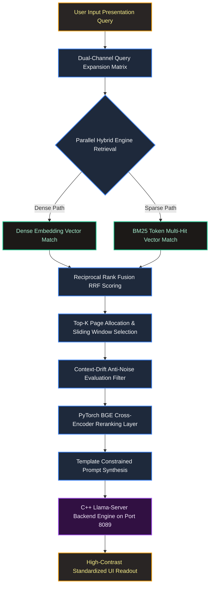

# MerckRAG
Merck Manual Medical Diagnosis RAG Project

🚀 Check live demo at: https://huggingface.co/spaces/AdarshRL/medical-diagnostic-rag-dashboard
> As it is going to run on CPU backend, the final response may come over 3-5 minutes late. You can see all the steps that it will take before generating the response in the flow diagram below ⬇️⬇️
### Merck Manual
The Merck Manuals represent one of the world's most enduring and comprehensive medical reference resources. Originally established in 1899 as a pocket-sized guide for physicians and pharmacists, the series has evolved into an expansive library covering a vast array of clinical disciplines, ranging from internal medicine and pediatrics to specialized pharmacology and surgical procedures.

### An Architecture-Guided, Local Hybrid Retrieval-Augmented Generation

---

## 💡 Project Idea & Core Objective

The volume of biomedical literature and clinical practice manuals makes real-time, evidence-based decision-making a challenge for point-of-care practitioners. Standard search tools rely heavily on rigid keyword matching, whereas standalone large language models (LLMs) are prone to factual hallucinations when separated from authoritative clinical source documents.

This project implements a self-contained, high-performance **Local Clinical Diagnostic Retrieval-Augmented Generation (RAG) System** explicitly designed to process complex, multi-layered clinical manuals. The core idea is to establish a secure, private, and deterministic processing pipeline capable of taking natural semantic medical presentation queries (e.g., symptom profiles), expanding them to account for varied medical nomenclature, retrieving contextually accurate information without domain-drift, and compiling validated diagnostic summaries matching a standardized clinical workflow.

---

## 🛠️ System Methodology

The framework minimizes semantic noise and guarantees high accuracy using a multi-layered extraction philosophy:

1. **Dual-Channel Query Expansion:** User queries are parsed and translated using local structural models into an expanded search matrix containing both the original presentation text and formal nomenclature variations. E.g.,
```text
User Query: ['schizophrenia treatment']
Rephrased Query Set: ['schizophrenia treatment', 'schizophrenia treatment options', 'treatment for schizophrenia patients']
```
2. **In-Memory Hybrid Storage Pool:** Rather than relying on external cloud network storage, a localized, unpickled **Qdrant Vector Database** runs entirely in-memory. The vector DB was populated first then converted to `.pkl`. The pipeline runs a dual-engine lookup:
   * **Dense Retrieval (Semantic Layer):** Computes deep vector dot-products using a dense embedding model to capture implicit context.
   * **Sparse Retrieval (Keyword Layer):** Generates high-efficiency token hits via an in-memory **BM25 Text Encoder** to secure hyper-specific diagnostic terminology (e.g., drug names, syndromes).
3. **Reciprocal Rank Fusion (RRF):** Merges the disparate scoring distributions of the sparse and dense result arrays into a unified, balanced page-ranking matrix.
4. **Context-Drift Guardrails & Sliding Window Expansion:** The system automatically locks onto the top-ranked pages and creates a sliding window, taking one page before and after the top-ranked page, (Page +/- 1) to capture contiguous treatment sheets. It applies an intersection token filter that down-weights cross-context noise (e.g., preventing severe oncology radiation data from bleeding into a basic abdominal ache query).
5. **Cross-Encoder Neural Reranking:** Candidate text slices are routed through a localized, PyTorch-accelerated `BAAI/bge-reranker-large` Cross-Encoder model, ensuring maximum semantic alignment before constructing the prompt block.
6. **Constrained Structural Synthesis:** The final context window is interpreted by a local C++ inference daemon (`llama-server`) using strict token-stopping templates to generate structured markdown readouts.

---

## 🔄 System Architecture Flow

The following block diagram outlines the live data routing and processing pipeline of the system node:



A sample trace of the app's log is shown below which shows all of the above mentioned steps being taken and their outputs:

```log
🔍 Sending prompt to LLM (len: 612)...
[llama.cpp] 1499.48.764.407 I slot get_availabl: id  0 | task -1 | selected slot by LRU, t_last = 278611597335
[llama.cpp] 1499.48.764.431 I srv  get_availabl: updating prompt cache
[llama.cpp] 1499.48.769.796 W srv   prompt_save:  - saving prompt with length 1192, total state size = 223.514 MiB (draft: 0.000 MiB)
[llama.cpp] 1499.50.412.807 I srv          load:  - looking for better prompt, base f_keep = 0.004, sim = 0.042
[llama.cpp] 1499.50.412.815 I srv          load:  - found better prompt with f_keep = 0.763, sim = 0.891
[llama.cpp] 1499.50.448.616 I srv        update:  - cache state: 1 prompts, 223.514 MiB (limits: 8192.000 MiB, 4096 tokens, 43687 est)
[llama.cpp] 1499.50.448.631 I srv        update:    - prompt 0x563b15373960:    1192 tokens, checkpoints:  0,   223.514 MiB
[llama.cpp] 1499.50.448.633 I srv  get_availabl: prompt cache update took 1684.20 ms
[llama.cpp] 1499.50.453.689 I slot launch_slot_: id  0 | task 202 | processing task, is_child = 0
[llama.cpp] 1501.04.255.022 I slot print_timing: id  0 | task 202 | prompt eval time =   10214.37 ms /    13 tokens (  785.72 ms per token,     1.27 tokens per second)
[llama.cpp] 1501.04.255.039 I slot print_timing: id  0 | task 202 |        eval time =   63586.88 ms /    37 tokens ( 1718.56 ms per token,     0.58 tokens per second)
[llama.cpp] 1501.04.255.040 I slot print_timing: id  0 | task 202 |       total time =   73801.26 ms /    50 tokens
[llama.cpp] 1501.04.257.076 I slot print_timing: id  0 | task 202 |    graphs reused =        226
[llama.cpp] 1501.04.290.096 I slot      release: id  0 | task 202 | stop processing: n_tokens = 155, truncated = 0
[llama.cpp] 1501.04.291.027 I srv  update_slots: all slots are idle
Expansion Output Before Formatting Check:  Query 1: What are the most frequent reasons for a runny nose in humans?
     Query 2: What triggers a runny nose and what can be done to alleviate it?
🗯️ Rephrased Queries:  ['common causes of runny nose?']

🛰️ [RETRIEVAL TRACE] Running vector operations for query: 'common causes of runny nose?'
📥 Dense returned 25 nodes | Sparse returned 25 nodes.
🎯 RRF Ranked Target Top Pages: [589, 675]
🪟 Expanding Sliding Windows to pull all chunks from page cluster: [588, 589, 590, 674, 675, 676]
📊 Gathered 36 candidate chunks for BGE Reranker processing.
🔠📲 LLM Input:
 --- SOURCE: PAGE 588 (Bacterial Infections) | SCORE: 5.726626694202423 ---
CONTEXT: Bacterial Infections

Nasal vestibulitis is bacterial infection of the nasal vestibule, typically with Staphylococcus aureus . It may result from nose picking or excessive nose blowing and causes annoying crusts and bleeding when the crusts slough off. Bacitracin or mupirocin ointment applied topically bid for 14 days is effective.

--- SOURCE: PAGE 589 (Rhinitis) | SCORE: 6.867285370826721 ---
CONTEXT: Rhinitis

Acute rhinitis: This form of rhinitis, manifesting with edema and vasodilation of the nasal mucous membrane, rhinorrhea, and obstruction, is usually the result of a common cold (see p. 1404); other causes include streptococcal, pneumococcal, and staphylococcal infections.

--- SOURCE: PAGE 675 (Decreased nasolacrimal drainage: The most common causes are) | SCORE: 6.889015197753906 ---
CONTEXT: Decreased nasolacrimal drainage: The most common causes are

- Burns
- Chemotherapy drugs
- Eye drops (particularly echothiophate iodide, epinephrine, and pilocarpine)
- Infection, including canaliculitis (eg, caused by Staphylococcus aureus , Actinomyces , Streptococcus , Pseudomonas , herpes zoster virus, herpes simplex conjunctivitis, infectious mononucleosis, human papillomavirus, Ascaris , leprosy, TB)
- Inflammatory disorders (sarcoidosis, Wegener's granulomatosis)
- Injuries (eg, nasoethmoid fractures; nasal, orbital, or endoscopic sinus surgery)
- Obstruction of nasal outlet despite an intact nasolacrimal system (eg, URI, allergic rhinitis, sinusitis)
- Radiation therapy

🧠 Final Context Token Count: 447
📏 Final Prompt Length: 2506 chars
🧠 Final Prompt Tokens: 614
🔍 Sending prompt to LLM (len: 2506)...
[llama.cpp] 1501.53.591.203 I slot get_availabl: id  0 | task -1 | selected slot by LRU, t_last = 368164719379
[llama.cpp] 1501.53.591.209 I srv  get_availabl: updating prompt cache
[llama.cpp] 1501.53.591.473 W srv   prompt_save:  - saving prompt with length 155, total state size = 29.065 MiB (draft: 0.000 MiB)
[llama.cpp] 1501.53.655.108 I srv          load:  - looking for better prompt, base f_keep = 0.032, sim = 0.008
[llama.cpp] 1501.53.655.268 I srv        update:  - cache state: 2 prompts, 252.579 MiB (limits: 8192.000 MiB, 4096 tokens, 43687 est)
[llama.cpp] 1501.53.655.346 I srv        update:    - prompt 0x563b15373960:    1192 tokens, checkpoints:  0,   223.514 MiB
[llama.cpp] 1501.53.655.414 I srv        update:    - prompt 0x563b1580e030:     155 tokens, checkpoints:  0,    29.065 MiB
[llama.cpp] 1501.53.655.476 I srv  get_availabl: prompt cache update took 64.27 ms
[llama.cpp] 1501.53.655.593 I slot launch_slot_: id  0 | task 240 | processing task, is_child = 0
[llama.cpp] 1501.57.558.693 I slot print_timing: id  0 | task 240 | prompt processing, n_tokens =     32, progress = 0.06, t =   3.90 s / 8.20 tokens per second
[llama.cpp] 1502.03.009.640 I slot print_timing: id  0 | task 240 | prompt processing, n_tokens =     64, progress = 0.11, t =   9.35 s / 6.84 tokens per second
[llama.cpp] 1502.06.513.892 I slot print_timing: id  0 | task 240 | prompt processing, n_tokens =     96, progress = 0.16, t =  12.85 s / 7.47 tokens per second
[llama.cpp] 1502.10.326.390 I slot print_timing: id  0 | task 240 | prompt processing, n_tokens =    128, progress = 0.22, t =  16.67 s / 7.68 tokens per second
[llama.cpp] 1502.17.016.689 I slot print_timing: id  0 | task 240 | prompt processing, n_tokens =    160, progress = 0.27, t =  23.36 s / 6.85 tokens per second
[llama.cpp] 1502.20.835.850 I slot print_timing: id  0 | task 240 | prompt processing, n_tokens =    192, progress = 0.32, t =  27.18 s / 7.06 tokens per second
[llama.cpp] 1502.23.718.991 I slot print_timing: id  0 | task 240 | prompt processing, n_tokens =    224, progress = 0.37, t =  30.06 s / 7.45 tokens per second
[llama.cpp] 1502.27.085.908 I slot print_timing: id  0 | task 240 | prompt processing, n_tokens =    256, progress = 0.43, t =  33.43 s / 7.66 tokens per second
[llama.cpp] 1502.30.915.002 I slot print_timing: id  0 | task 240 | prompt processing, n_tokens =    288, progress = 0.48, t =  37.26 s / 7.73 tokens per second
[llama.cpp] 1502.34.198.189 I slot print_timing: id  0 | task 240 | prompt processing, n_tokens =    320, progress = 0.53, t =  40.54 s / 7.89 tokens per second
[llama.cpp] 1502.38.210.169 I slot print_timing: id  0 | task 240 | prompt processing, n_tokens =    352, progress = 0.58, t =  44.55 s / 7.90 tokens per second
[llama.cpp] 1502.43.214.478 I slot print_timing: id  0 | task 240 | prompt processing, n_tokens =    384, progress = 0.63, t =  49.56 s / 7.75 tokens per second
[llama.cpp] 1502.52.789.119 I slot print_timing: id  0 | task 240 | prompt processing, n_tokens =    416, progress = 0.69, t =  59.13 s / 7.03 tokens per second
[llama.cpp] 1502.57.627.349 I slot print_timing: id  0 | task 240 | prompt processing, n_tokens =    448, progress = 0.74, t =  63.97 s / 7.00 tokens per second
[llama.cpp] 1503.04.685.983 I slot print_timing: id  0 | task 240 | prompt processing, n_tokens =    480, progress = 0.79, t =  71.03 s / 6.76 tokens per second
[llama.cpp] 1503.11.845.837 I slot print_timing: id  0 | task 240 | prompt processing, n_tokens =    512, progress = 0.84, t =  78.19 s / 6.55 tokens per second
[llama.cpp] 1503.16.891.834 I slot print_timing: id  0 | task 240 | prompt processing, n_tokens =    544, progress = 0.89, t =  83.24 s / 6.54 tokens per second
[llama.cpp] 1503.20.238.801 I slot print_timing: id  0 | task 240 | prompt processing, n_tokens =    576, progress = 0.95, t =  86.58 s / 6.65 tokens per second
[llama.cpp] 1503.24.425.612 I slot print_timing: id  0 | task 240 | prompt processing, n_tokens =    608, progress = 1.00, t =  90.77 s / 6.70 tokens per second
[llama.cpp] 1505.21.975.870 I slot print_timing: id  0 | task 240 | n_decoded =    100, tg =   0.86 t/s
[llama.cpp] 1505.25.270.184 I slot print_timing: id  0 | task 240 | n_decoded =    105, tg =   0.88 t/s
[llama.cpp] 1505.28.769.456 I slot print_timing: id  0 | task 240 | n_decoded =    108, tg =   0.88 t/s
[llama.cpp] 1505.32.332.565 I slot print_timing: id  0 | task 240 | n_decoded =    110, tg =   0.87 t/s
[llama.cpp] 1505.36.484.772 I slot print_timing: id  0 | task 240 | n_decoded =    115, tg =   0.88 t/s
[llama.cpp] 1505.39.949.212 I slot print_timing: id  0 | task 240 | n_decoded =    119, tg =   0.89 t/s
[llama.cpp] 1505.43.491.850 I slot print_timing: id  0 | task 240 | n_decoded =    124, tg =   0.90 t/s
[llama.cpp] 1505.46.930.602 I slot print_timing: id  0 | task 240 | n_decoded =    126, tg =   0.89 t/s
[llama.cpp] 1505.50.511.900 I slot print_timing: id  0 | task 240 | n_decoded =    130, tg =   0.90 t/s
[llama.cpp] 1505.54.018.748 I slot print_timing: id  0 | task 240 | n_decoded =    133, tg =   0.90 t/s
[llama.cpp] 1505.57.681.797 I slot print_timing: id  0 | task 240 | n_decoded =    136, tg =   0.90 t/s
[llama.cpp] 1506.00.911.455 I slot print_timing: id  0 | task 240 | n_decoded =    139, tg =   0.90 t/s
[llama.cpp] 1506.03.996.120 I slot print_timing: id  0 | task 240 | n_decoded =    142, tg =   0.90 t/s
[llama.cpp] 1506.08.603.587 I slot print_timing: id  0 | task 240 | n_decoded =    145, tg =   0.89 t/s
[llama.cpp] 1506.11.709.553 I slot print_timing: id  0 | task 240 | n_decoded =    147, tg =   0.89 t/s
[llama.cpp] 1506.15.294.068 I slot print_timing: id  0 | task 240 | n_decoded =    150, tg =   0.89 t/s
[llama.cpp] 1506.18.620.536 I slot print_timing: id  0 | task 240 | n_decoded =    153, tg =   0.89 t/s
[llama.cpp] 1506.21.757.719 I slot print_timing: id  0 | task 240 | n_decoded =    156, tg =   0.89 t/s
[llama.cpp] 1506.25.449.741 I slot print_timing: id  0 | task 240 | n_decoded =    160, tg =   0.89 t/s
[llama.cpp] 1506.29.324.253 I slot print_timing: id  0 | task 240 | n_decoded =    163, tg =   0.89 t/s
[llama.cpp] 1506.32.539.825 I slot print_timing: id  0 | task 240 | n_decoded =    166, tg =   0.89 t/s
[llama.cpp] 1506.36.041.125 I slot print_timing: id  0 | task 240 | n_decoded =    171, tg =   0.90 t/s
[llama.cpp] 1506.40.456.953 I slot print_timing: id  0 | task 240 | n_decoded =    173, tg =   0.89 t/s
[llama.cpp] 1506.43.551.052 I slot print_timing: id  0 | task 240 | n_decoded =    176, tg =   0.89 t/s
[llama.cpp] 1506.46.568.066 I slot print_timing: id  0 | task 240 | n_decoded =    179, tg =   0.89 t/s
[llama.cpp] 1506.50.225.720 I slot print_timing: id  0 | task 240 | n_decoded =    181, tg =   0.89 t/s
[llama.cpp] 1506.54.873.623 I slot print_timing: id  0 | task 240 | n_decoded =    185, tg =   0.89 t/s
[llama.cpp] 1506.58.100.006 I slot print_timing: id  0 | task 240 | n_decoded =    188, tg =   0.89 t/s
[llama.cpp] 1507.01.685.958 I slot print_timing: id  0 | task 240 | n_decoded =    192, tg =   0.89 t/s
[llama.cpp] 1507.05.716.767 I slot print_timing: id  0 | task 240 | n_decoded =    195, tg =   0.89 t/s
[llama.cpp] 1507.09.603.702 I slot print_timing: id  0 | task 240 | n_decoded =    199, tg =   0.89 t/s
[llama.cpp] 1507.12.884.705 I slot print_timing: id  0 | task 240 | n_decoded =    202, tg =   0.89 t/s
[llama.cpp] 1507.16.967.471 I slot print_timing: id  0 | task 240 | n_decoded =    206, tg =   0.89 t/s
[llama.cpp] 1507.20.892.197 I slot print_timing: id  0 | task 240 | n_decoded =    209, tg =   0.89 t/s
[llama.cpp] 1507.24.208.507 I slot print_timing: id  0 | task 240 | n_decoded =    212, tg =   0.89 t/s
[llama.cpp] 1507.27.631.560 I slot print_timing: id  0 | task 240 | n_decoded =    215, tg =   0.89 t/s
[llama.cpp] 1507.31.301.370 I slot print_timing: id  0 | task 240 | n_decoded =    220, tg =   0.90 t/s
[llama.cpp] 1507.35.294.230 I slot print_timing: id  0 | task 240 | n_decoded =    223, tg =   0.89 t/s
[llama.cpp] 1507.38.760.454 I slot print_timing: id  0 | task 240 | n_decoded =    226, tg =   0.89 t/s
[llama.cpp] 1507.43.044.881 I slot print_timing: id  0 | task 240 | n_decoded =    231, tg =   0.90 t/s
[llama.cpp] 1507.46.536.867 I slot print_timing: id  0 | task 240 | n_decoded =    234, tg =   0.90 t/s
[llama.cpp] 1507.47.833.435 I slot print_timing: id  0 | task 240 | prompt eval time =   92314.39 ms /   609 tokens (  151.58 ms per token,     6.60 tokens per second)
[llama.cpp] 1507.47.834.653 I slot print_timing: id  0 | task 240 |        eval time =  261863.35 ms /   235 tokens ( 1114.31 ms per token,     0.90 tokens per second)
[llama.cpp] 1507.47.834.655 I slot print_timing: id  0 | task 240 |       total time =  354177.74 ms /   844 tokens
[llama.cpp] 1507.47.834.668 I slot print_timing: id  0 | task 240 |    graphs reused =        475
[llama.cpp] 1507.47.881.914 I slot      release: id  0 | task 240 | stop processing: n_tokens = 848, truncated = 0
[llama.cpp] 1507.47.882.363 I srv  update_slots: all slots are idle
👉 LLM Output:  Condition:
     - runny nose

     Symptoms:
     - watery eyes
     - sneezing
     - congestion
     - postnasal drip
     - nasal discharge
     - coughing
     - sore throat
     - headache
     - fatigue
     - fever
     - loss of smell
     - earache
     - sinus pressure
     - bad breath
     - eye irritation
     - redness in the eyes

     Treatments:
     - anti-inflammatory drugs (eg, ibuprofen)
     - decongestants (eg, pseudoephedrine)
     - antihistamines (eg, cetirizine)
     - nasal sprays (eg, fluticasone propionate, mometasone furoate)
     - saline nasal spray or drops
     - steam inhalation
     - humidification of the air
     - avoiding allergens and irritants

     Clinical Summary:
     Nasal congestion is a common symptom associated with various causes such as colds, allergies, sinus infections, and respiratory tract infections. Treatment options include over-the-counter medications like decongestants and antihistamines, saline nasal sprays or drops, steam inhalation, humidification of the air, avoiding allergens and irritants, and staying hydrated to help alleviate symptoms.
```
---

## 📡 Deployment Scenarios & Architectural Divergence

This architecture has been compiled across two completely distinct operational baselines to accommodate compute-tier variability:

### 🚀 Google Colab Production Environment

* **Compute Tier:** High-VRAM Dedicated Hardware Acceleration (GPU enabled).
* **Language Model:** `MiniCPM-V-4.6` executed natively in its 4-bit quantized GGUF format via a multi-threaded, local C++ background daemon (`llama-server`) pinned to port `8089`.
* **Context Budget:** Expanded attention workspace limited to **4096 tokens** to support heavy, raw contiguous document pages.
* **Characteristics:** Full-scale inference execution leveraging the deep, multi-tiered neural layers of the model.

### ☁️ Hugging Face Space Node

* **Compute Tier:** Shared Public Space Infrastructure (Strictly CPU-Bound Container Limits).
* **Resource Constraint Isolation:** Running a full-scale C++ local backend engine (`llama-server`) parsing massive GGUF weight matrices inside a free tier CPU Hugging Face Space quickly triggers automated Operating System **Out-Of-Memory (OOM) Core Kills** or causes extreme processing latency.
* **Architectural Adjustment:** To maintain complete pipeline uptime and low-latency metrics under strict hardware ceilings, the space leverages an efficient, lightweight **SmolAgent** orchestration wrapper. It shifts heavy autoregressive text generation to compact token frameworks while preserving identical Qdrant hybrid retrieval and anti-drift processing logic natively inside the space environment.

---

## 🏁 Conclusion

By combining the keyword precision of BM25 with the conceptual abstraction of Dense Vector matching, the system addresses the primary challenges of domain-specific RAG deployments. The integration of Reciprocal Rank Fusion, sliding window pagination context, and cross-encoder neural filtering ensures that the downstream local language model receives a curated, zero-noise context stream. This mitigates hallucination and prevents context drift, delivering a reliable, private tool for clinical manual data processing.
