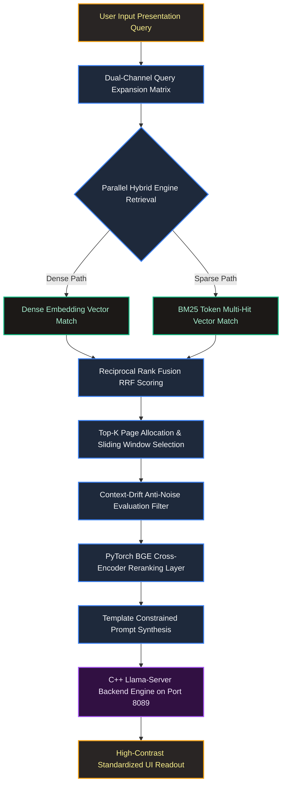

# MerckRAG
Merck Manual Medical Diagnosis RAG Project

🚀 Check live demo at: https://huggingface.co/spaces/AdarshRL/medical-diagnostic-rag-dashboard
> As it is going to run on CPU backend, the final response may come over 3-5 minutes late. You can see all the steps that it will take before generating the response in the flow diagram below ⬇️⬇️
### Merck Manual
The Merck Manuals represent one of the world's most enduring and comprehensive medical reference resources. Originally established in 1899 as a pocket-sized guide for physicians and pharmacists, the series has evolved into an expansive library covering a vast array of clinical disciplines, ranging from internal medicine and pediatrics to specialized pharmacology and surgical procedures.

### An Architecture-Guided, Local Hybrid Retrieval-Augmented Generation

---

## 💡 Project Idea & Core Objective

The volume of biomedical literature and clinical practice manuals makes real-time, evidence-based decision-making a challenge for point-of-care practitioners. Standard search tools rely heavily on rigid keyword matching, whereas standalone large language models (LLMs) are prone to factual hallucinations when separated from authoritative clinical source documents.

This project implements a self-contained, high-performance **Local Clinical Diagnostic Retrieval-Augmented Generation (RAG) System** explicitly designed to process complex, multi-layered clinical manuals. The core idea is to establish a secure, private, and deterministic processing pipeline capable of taking natural semantic medical presentation queries (e.g., symptom profiles), expanding them to account for varied medical nomenclature, retrieving contextually accurate information without domain-drift, and compiling validated diagnostic summaries matching a standardized clinical workflow.

---

## 🛠️ System Methodology

The framework minimizes semantic noise and guarantees high accuracy using a multi-layered extraction philosophy:

1. **Dual-Channel Query Expansion:** User queries are parsed and translated using local structural models into an expanded search matrix containing both the original presentation text and formal nomenclature variations. E.g.,
```text
User Query: ['schizophrenia treatment']
Rephrased Query Set: ['schizophrenia treatment', 'schizophrenia treatment options', 'treatment for schizophrenia patients']
```
2. **In-Memory Hybrid Storage Pool:** Rather than relying on external cloud network storage, a localized, unpickled **Qdrant Vector Database** runs entirely in-memory. The vector DB was populated first then converted to `.pkl`. The pipeline runs a dual-engine lookup:
   * **Dense Retrieval (Semantic Layer):** Computes deep vector dot-products using a dense embedding model to capture implicit context.
   * **Sparse Retrieval (Keyword Layer):** Generates high-efficiency token hits via an in-memory **BM25 Text Encoder** to secure hyper-specific diagnostic terminology (e.g., drug names, syndromes).
3. **Reciprocal Rank Fusion (RRF):** Merges the disparate scoring distributions of the sparse and dense result arrays into a unified, balanced page-ranking matrix.
4. **Context-Drift Guardrails & Sliding Window Expansion:** The system automatically locks onto the top-ranked pages and creates a sliding window, taking one page before and after the top-ranked page, (Page +/- 1) to capture contiguous treatment sheets. It applies an intersection token filter that down-weights cross-context noise (e.g., preventing severe oncology radiation data from bleeding into a basic abdominal ache query).
5. **Cross-Encoder Neural Reranking:** Candidate text slices are routed through a localized, PyTorch-accelerated `BAAI/bge-reranker-large` Cross-Encoder model, ensuring maximum semantic alignment before constructing the prompt block.
6. **Constrained Structural Synthesis:** The final context window is interpreted by a local C++ inference daemon (`llama-server`) using strict token-stopping templates to generate structured markdown readouts.

---

## 🔄 System Architecture Flow

The following block diagram outlines the live data routing and processing pipeline of the system node:



---

## 📡 Deployment Scenarios & Architectural Divergence

This architecture has been compiled across two completely distinct operational baselines to accommodate compute-tier variability:

### 🚀 Google Colab Production Environment

* **Compute Tier:** High-VRAM Dedicated Hardware Acceleration (GPU enabled).
* **Language Model:** `MiniCPM-V-4.6` executed natively in its 4-bit quantized GGUF format via a multi-threaded, local C++ background daemon (`llama-server`) pinned to port `8089`.
* **Context Budget:** Expanded attention workspace limited to **4096 tokens** to support heavy, raw contiguous document pages.
* **Characteristics:** Full-scale inference execution leveraging the deep, multi-tiered neural layers of the model.

### ☁️ Hugging Face Space Node

* **Compute Tier:** Shared Public Space Infrastructure (Strictly CPU-Bound Container Limits).
* **Resource Constraint Isolation:** Running a full-scale C++ local backend engine (`llama-server`) parsing massive GGUF weight matrices inside a free tier CPU Hugging Face Space quickly triggers automated Operating System **Out-Of-Memory (OOM) Core Kills** or causes extreme processing latency.
* **Architectural Adjustment:** To maintain complete pipeline uptime and low-latency metrics under strict hardware ceilings, the space leverages an efficient, lightweight **SmolAgent** orchestration wrapper. It shifts heavy autoregressive text generation to compact token frameworks while preserving identical Qdrant hybrid retrieval and anti-drift processing logic natively inside the space environment.

---

## 🏁 Conclusion

By combining the keyword precision of BM25 with the conceptual abstraction of Dense Vector matching, the system addresses the primary challenges of domain-specific RAG deployments. The integration of Reciprocal Rank Fusion, sliding window pagination context, and cross-encoder neural filtering ensures that the downstream local language model receives a curated, zero-noise context stream. This mitigates hallucination and prevents context drift, delivering a reliable, private tool for clinical manual data processing.
